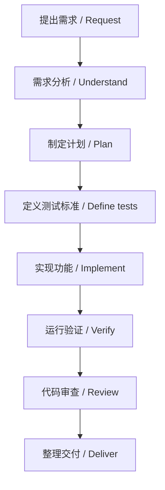

AI 编程工具已经能创建文件、修改代码、运行测试，甚至实现完整功能。但“能写出代码”和“能稳定地完成软件开发”之间，仍然隔着需求理解、方案选择、测试验证和安全交付这些关键环节。

AI coding tools can now create files, edit code, run tests, and even implement complete features. But there is still a meaningful gap between *producing code* and *reliably delivering software*: understanding requirements, choosing an approach, testing, verifying, and handing work over safely.

`Superpowers` 可以理解为一套给 AI 编程助手使用的软件开发工作流技能。它不是新的编程语言，也不是另一个代码生成模型；它的重点是让 AI 在不同任务里按合适的顺序思考、行动和验证。

`Superpowers` can be understood as a set of software-engineering workflow skills for AI coding assistants. It is not a programming language or another code-generation model. Its purpose is to help an AI think, act, and verify in the right order for each kind of task.

## 为什么 AI 写代码仍然会失控？

## Why can AI coding still go off track?

简单任务通常很顺利。但随着项目变大，AI 可能在没有充分理解需求时就开始修改；触碰了无关文件；只修复表象而没有定位根因；或者在没有验证的情况下宣布“已完成”。多个任务并行时，代码之间还可能互相干扰。

Small tasks often go smoothly. As a project grows, however, an AI may start editing before it fully understands the request, touch unrelated files, fix symptoms instead of root causes, or announce completion without verification. Parallel tasks can also interfere with one another.

普通的交互往往像这样：

> 用户提出需求，AI 立刻修改代码。

A typical interaction often looks like this:

> The user asks for a change, and the AI immediately edits the code.

Superpowers 希望把它变成一条更可靠的链路：

Superpowers aims to turn that into a more dependable sequence:

> 理解需求 → 讨论方案 → 制定计划 → 建立测试标准 → 实现功能 → 执行验证 → 审查与交付

> Understand the request → discuss the design → make a plan → define test criteria → implement → verify → review and deliver

它的目标不是让 AI “写得更多”，而是让复杂任务更可控、可追踪，也更容易证明结果是否真的正确。

The goal is not to make an AI write *more* code. It is to make complex work more controlled, traceable, and easier to prove correct.

## 核心技能

## Core skills

### 1. Brainstorming：先把需求想清楚

### 1. Brainstorming: understand before building

`brainstorming` 用于开发前的需求分析和方案设计。它会先帮助梳理用户目标、功能边界、技术限制、潜在风险和可选方案，而不是急着开始编码。

`brainstorming` is for requirements analysis and design before development. It helps clarify the user's goal, scope, technical constraints, risks, and viable approaches before code is written.

例如，“给网站增加用户登录”看似简单，但需要先明确：使用密码、手机号还是第三方登录？用户信息存在哪里？是否需要验证码、角色权限、登录状态和失败次数限制？没有这些答案就直接实现，很容易得到“能运行但不符合实际需求”的功能。

For example, “add user login to a website” sounds simple, but raises immediate questions: passwords, phone numbers, or third-party sign-in? Where does user data live? Are verification codes, roles, sessions, or rate limits needed? Implementing first can easily produce something that runs but does not meet the real need.

### 2. Writing Plans：把复杂任务拆开

### 2. Writing Plans: break down complex work

当需求涉及多个模块时，`writing-plans` 会将它拆成可执行、可检查的步骤，并列出涉及的文件、依赖关系、风险点和验证方式。

When a request spans multiple modules, `writing-plans` breaks it into executable, checkable steps and identifies affected files, dependencies, risks, and validation methods.

比如“为博客增加搜索、标签、评论、用户中心和后台管理”并不是一个功能，而是一组相互关联的子系统。先拆分数据结构、搜索、标签筛选、评论、身份认证和后台页面，问题出现时才更容易定位，也更容易控制改动范围。

For instance, “add search, tags, comments, accounts, and an admin area to a blog” is not one feature; it is a collection of connected subsystems. Separating data structures, search, tag filtering, comments, authentication, and administration makes failures easier to locate and limits the blast radius of changes.

### 3. Test-Driven Development：先定义正确是什么

### 3. Test-Driven Development: define correctness first

`test-driven-development` 的核心是先定义功能必须满足的行为，再实现代码。以限流为例，测试可以先规定：第一次请求成功、超过配额后失败、等待窗口结束后恢复、不同用户彼此隔离，并发时没有竞态问题。

The core idea of `test-driven-development` is to define the behavior a feature must satisfy before implementing it. For rate limiting, tests might specify that the first request succeeds, requests above the quota fail, access recovers after the time window, users remain isolated, and concurrency does not introduce races.

这能避免 AI 只写出“看起来合理”的实现，却遗漏边界条件。它尤其适合接口、数据处理、权限、存储和其他核心逻辑。

This prevents an AI from producing an implementation that merely *looks plausible* while missing edge cases. It is particularly valuable for APIs, data handling, permissions, storage, and other core logic.

### 4. Systematic Debugging：先确认事实，再动代码

### 4. Systematic Debugging: establish facts before editing

面对 Bug，最危险的方式是让 AI 不断猜测并修改。`systematic-debugging` 要求先复现问题、收集完整错误信息、定位发生位置、分析调用链、验证假设，再做最小修复并重新测试。

When a bug appears, the riskiest approach is to let an AI guess and edit repeatedly. `systematic-debugging` asks it to reproduce the issue, collect complete error information, locate the failure, inspect the call chain, test hypotheses, make the smallest viable fix, and test again.

例如数据库连接失败时，不能只把超时时间调大。还要检查服务是否启动、端口是否监听、网络和 DNS 是否可达、凭据和数据库名称是否正确、SSL 配置是否匹配，以及连接池是否耗尽。

For a database connection failure, simply increasing a timeout is not enough. The investigation should also check whether the service is running, the port is listening, network and DNS are reachable, credentials and database names are correct, SSL settings match, and the connection pool is not exhausted.

### 5. Verification Before Completion：没有证据，就不说完成

### 5. Verification Before Completion: no completion claim without evidence

代码写完不等于功能完成。`verification-before-completion` 要求交付前运行与任务相匹配的验证：单元或集成测试、构建、格式与静态检查、关键页面实际访问，以及 Git diff 检查。

Finished code is not the same as a finished feature. `verification-before-completion` requires task-appropriate evidence before delivery: unit or integration tests, a build, formatting and static checks, real inspection of key pages, and a Git diff review.

它强调一个简单却重要的原则：没有新鲜的验证结果，就不能声称任务已经完成。这个原则在生产环境和影响范围较大的修改中尤其重要。

It emphasizes a simple but important principle: without fresh verification evidence, an assistant should not claim that work is complete. This matters most for production systems and changes with a broad impact.

### 6. Code Review、Worktree 与并行代理

### 6. Code review, worktrees, and parallel agents

较大功能完成后，`requesting-code-review` 可以检查需求覆盖、逻辑错误、安全隐患、性能、错误处理和测试缺口。`using-git-worktrees` 则为不同任务提供隔离目录与分支，减少多个改动混在一起的风险。

After a larger feature is implemented, `requesting-code-review` can examine requirement coverage, logic errors, security concerns, performance, error handling, and testing gaps. `using-git-worktrees` provides isolated directories and branches for separate tasks, reducing the risk of unrelated changes getting mixed together.

如果任务边界清晰、改动文件不重叠，`dispatching-parallel-agents` 能让不同代理并行处理独立部分，例如前端检查、后端分析、测试补充和文档整理。但并行不是越多越好：共享同一文件或存在明显依赖的工作应该按顺序进行。

When task boundaries are clear and files do not overlap, `dispatching-parallel-agents` can let separate agents work in parallel on independent areas such as front-end review, back-end analysis, tests, and documentation. But more parallelism is not automatically better: work that shares files or has clear dependencies should remain sequential.

## 一条完整的工作流

## A complete workflow

在实际工作中，并非每个任务都要走完整流程。改一个拼写、替换一段文字或调整明确的配置项，可以快速处理并检查结果。涉及核心逻辑、数据结构、权限、网络、存储、重构或上线的任务，则值得投入更多分析、计划和验证。

In real work, not every task needs the full process. A spelling correction, text replacement, or clearly defined configuration change can be handled quickly and then checked. Work involving core logic, data structures, permissions, networking, storage, refactoring, or production release is worth deeper analysis, planning, and verification.

## Superpowers 和普通提示词的差别

## How Superpowers differs from ordinary prompts

你当然可以临时对 AI 说：“先分析需求，再写代码，完成后运行测试。”这在简单任务中很有用。区别在于，Superpowers 把这类要求沉淀成了可复用的流程，并针对创建功能、排查 Bug、实现逻辑、并行任务和收尾交付匹配不同方法。

You can absolutely tell an AI, “analyze the request first, then write code, then run tests.” That is useful for simple work. The difference is that Superpowers turns those reminders into reusable workflows and matches different methods to feature development, debugging, implementation, parallel work, and delivery.

可以把它理解为：普通提示词是一次性的提醒；Superpowers 是一套可以持续使用的开发制度。

One way to frame it is this: an ordinary prompt is a one-off reminder, while Superpowers is a repeatable development discipline.

## 它适合谁？

## Who is it for?

它适合独立开发者、频繁使用 AI 创建网站和工具的人、维护复杂工程的开发者，以及希望理解完整开发过程的初学者。对 Ceph、数据库、网络、分布式存储等风险较高的系统而言，“先分析、再计划、后验证”尤其有价值。

It suits independent developers, people who frequently use AI to build websites and tools, engineers maintaining complex systems, and beginners who want to understand the full development process. For higher-risk systems such as Ceph, databases, networking, and distributed storage, the sequence “analyze first, plan next, verify last” is particularly valuable.

当然，它不会自动让模型获得更多知识，也无法保证没有 Bug。代码质量仍然取决于模型能力、项目上下文、需求质量和验证覆盖面。它改善的是思考顺序、流程纪律与风险控制。

Of course, it does not magically give a model more knowledge or guarantee bug-free code. Quality still depends on the model, project context, the quality of requirements, and test coverage. What it improves is the order of reasoning, process discipline, and risk control.

## 结语

## Closing thoughts

更成熟的 AI 编程，不应该只是“让 AI 自动写代码”，而应当是让 AI 按可靠的软件工程方式，与人一起完成开发。Superpowers 提供的正是这样一种实践：开发前理解问题，实现前制定计划，修改后验证结果，交付前检查质量。

More mature AI-assisted programming should not be only about making an AI write code automatically. It should be about helping humans and AI build together using dependable software-engineering practices. That is the practice Superpowers promotes: understand before building, plan before implementing, verify after changing, and review before delivering.
